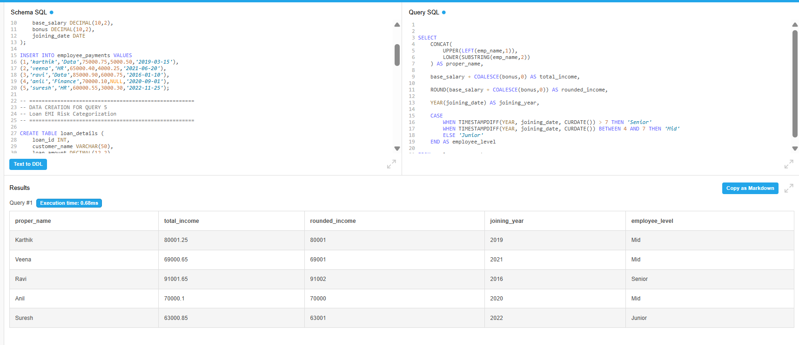
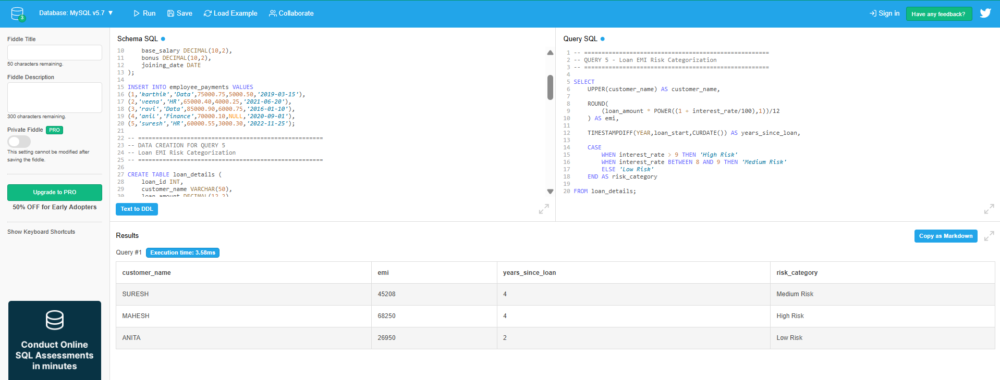
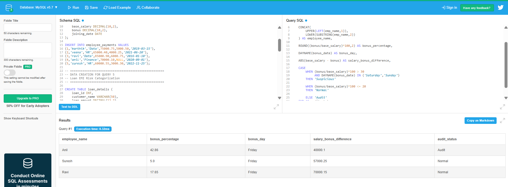
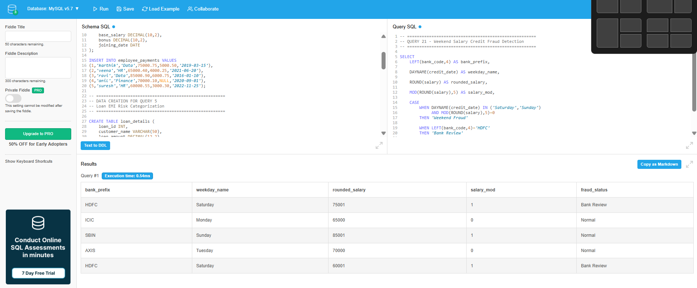
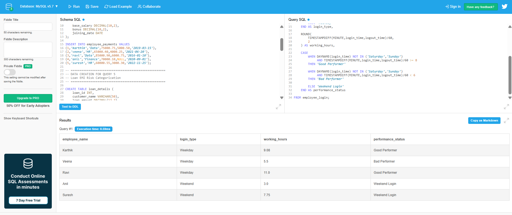

# Day 5 Output Screenshots

This folder contains selected query execution screenshots for Week 1 - Day 5 advanced SQL practice.

## Topics Covered

- String Functions
- Numerical Functions
- Date & Time Functions
- CASE Statements
- Conditional Logic
- Analytical SQL Queries
- Fraud Detection Queries
- Productivity Analysis
- Salary & Audit Based Queries

---

## 📸 Here are some output screenshots from the advanced SQL queries practiced using DB Fiddle.

---

# Query Outputs

## Query 1 - Employee Compensation Classification

---

## Query 5 - Loan EMI Risk Categorization

---

## Query 12 - Bonus Abuse Detection

---

## Query 21 - Weekend Salary Credit Fraud Detection

---

## Query 31 - Employee Login Discipline & Performance Classification

---

# Practice Platform

- DB Fiddle
- SQL Environment

---

# 📂 Output Files

| File Name | Description |
|---|---|
| query1.png | Employee compensation analysis output |
| query5.png | Loan EMI risk categorization output |
| query12.png | Bonus abuse detection output |
| query21.png | Weekend salary fraud detection output |
| query31.png | Employee login discipline analysis output |

---

Week 1 - Day 5 Outputs Completed 🚀
