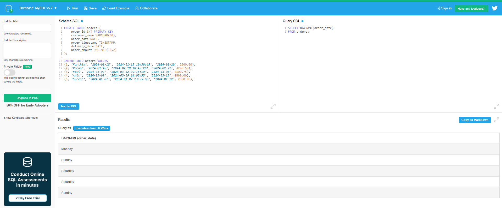
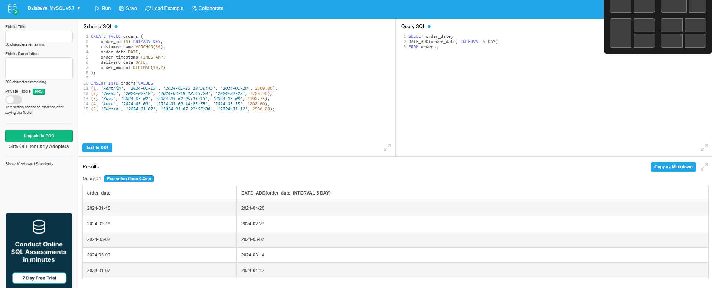
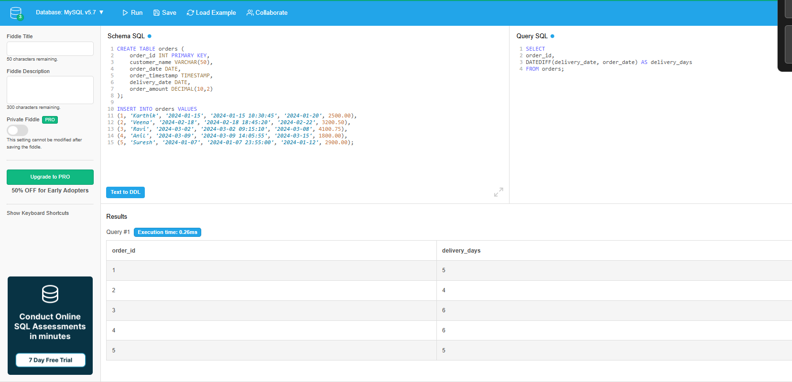
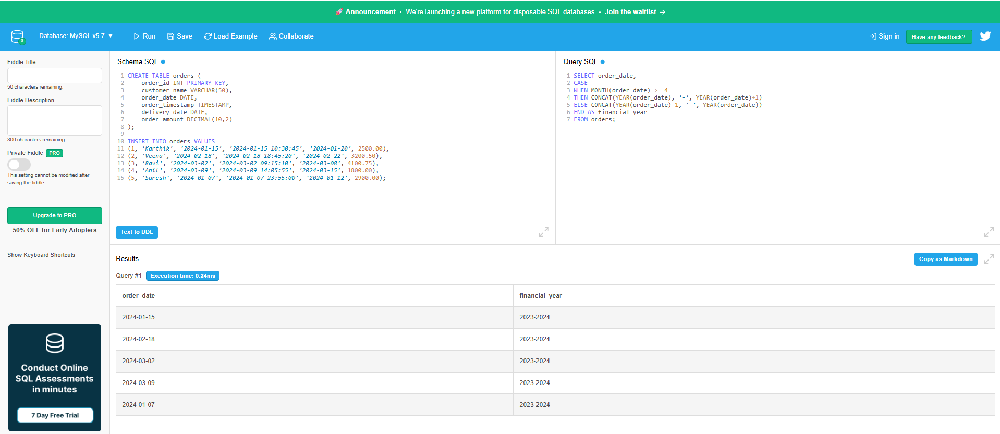

# Day 6 Output Screenshots

This folder contains selected query execution screenshots for Week 1 - Day 6 SQL practice on Date & Timestamp Functions.

## Topics Covered

- Current Date & Time Functions
- Date Extraction Functions
- Month & Day Functions
- Weekend & Weekday Detection
- Date Arithmetic
- Date Difference Functions
- Date Formatting
- Financial Year Logic
- Real-Time Business Queries

---

## 📸 Here are some output screenshots from the Date & Timestamp SQL queries practiced using DB Fiddle.

---

# Query Outputs

## Query 1 - Current Date Function

---

## Query 10 - Day Name Function

---

## Query 15 - DATE_ADD Function

---

## Query 20 - DATEDIFF Function

---

## Query 30 - Financial Year Logic

---

# Practice Platform

- DB Fiddle
- MySQL Environment

---

# 📂 Output Files

| File Name | Description |
|---|---|
| query1.png | Current date function output |
| query10.png | Day name extraction output |
| query15.png | Date addition function output |
| query20.png | Delivery date difference output |
| query30.png | Financial year calculation output |

---

Week 1 - Day 6 Outputs Completed 🚀
