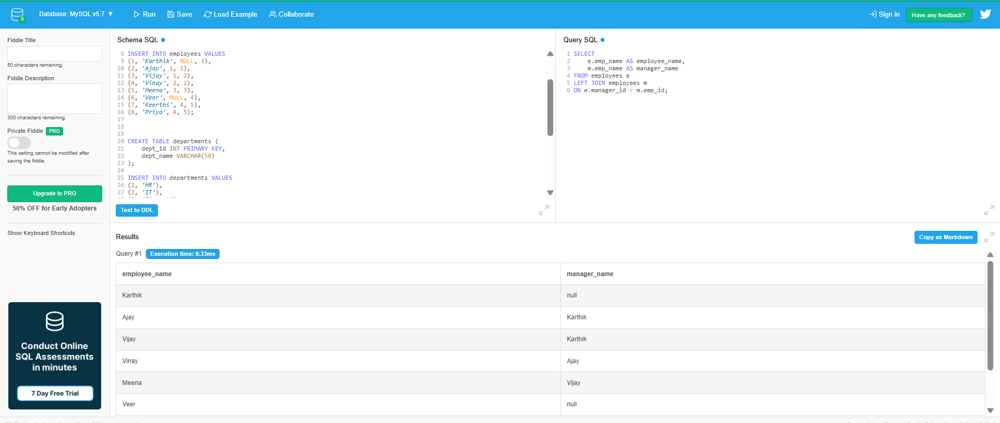
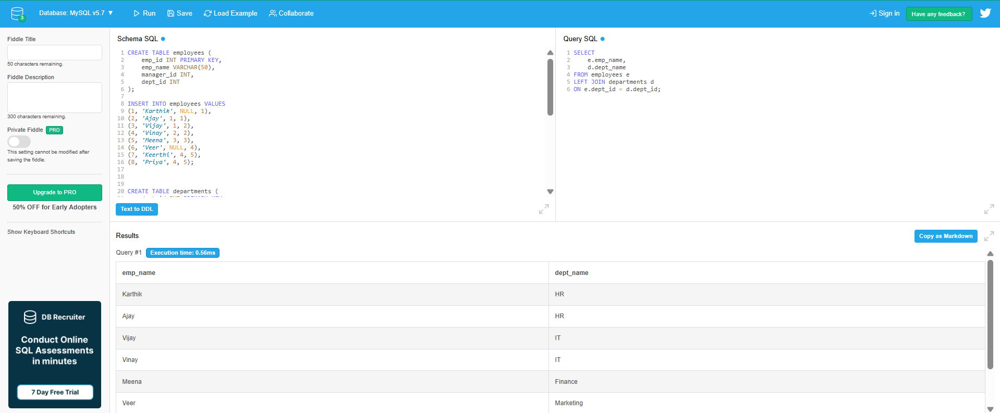
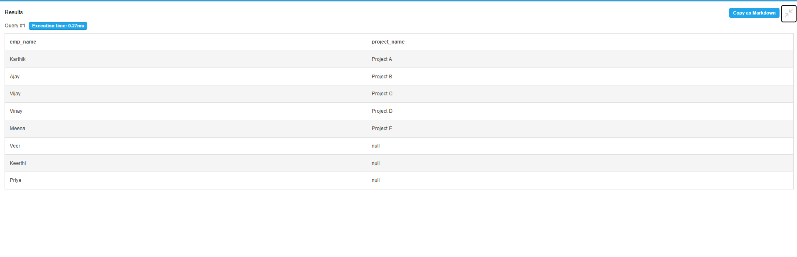
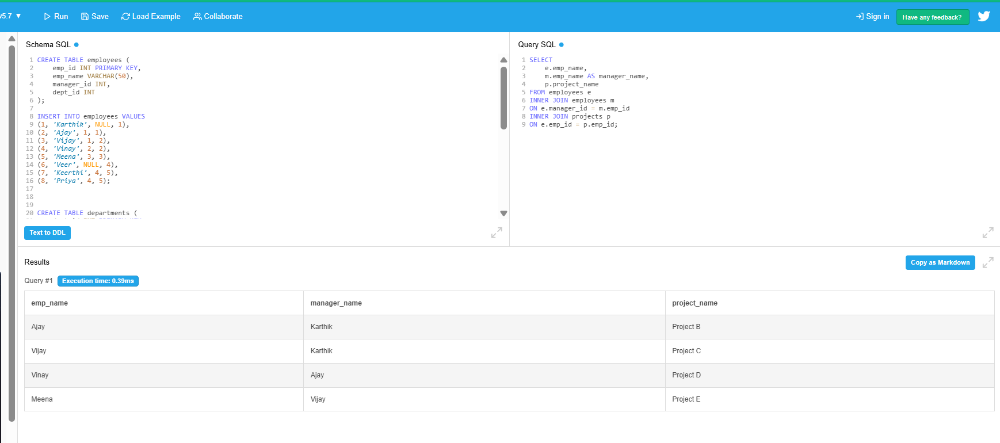
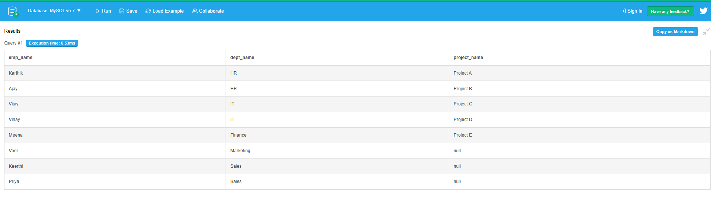

# Day 7 Output Screenshots

This folder contains selected query execution screenshots for Week 1 - Day 7 SQL JOIN practice.

## Topics Covered

- INNER JOIN
- LEFT JOIN
- RIGHT JOIN
- FULL OUTER JOIN
- SELF JOIN
- Employee-Manager Relationships
- Department Mapping
- Project Assignments
- NULL Handling in JOINs

---

## 📸 Here are some output screenshots from the SQL JOIN queries practiced using DB Fiddle.

---

# Query Outputs

## Query 1 - Employee and Manager Mapping

---

## Query 2 - Employees and Departments

---

## Query 6 - Employees and Assigned Projects

---

## Query 17 - Employees with Managers and Projects

---

## Query 29 - Employees with Department and Project Assignments

---

# Practice Platform

- DB Fiddle
- MySQL Environment

---

# 📂 Output Files

| File Name | Description |
|---|---|
| query1.png | Employee-manager relationship output |
| query2.png | Employee and department mapping output |
| query6.png | Employee project assignment output |
| query17.png | Employees with managers and projects output |
| query29.png | Complete employee, department, and project mapping |

---

Week 1 - Day 7 Outputs Completed 🚀
