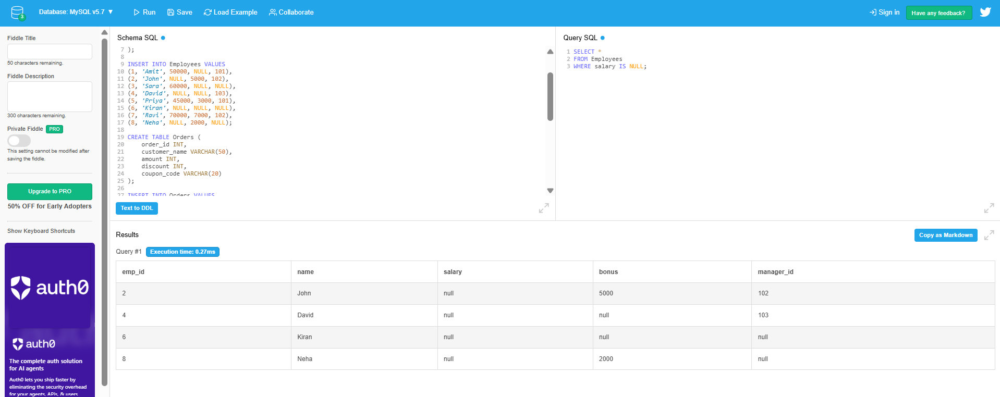
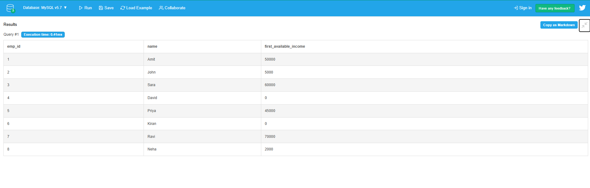
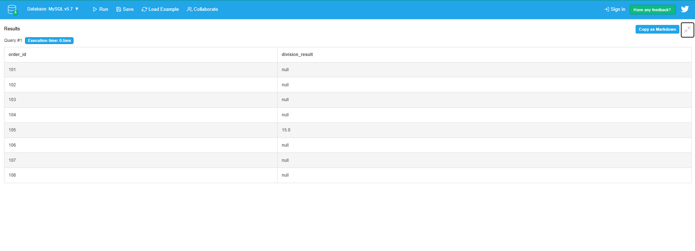
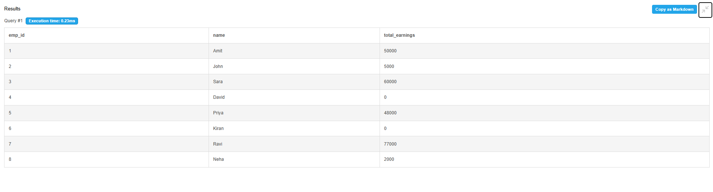
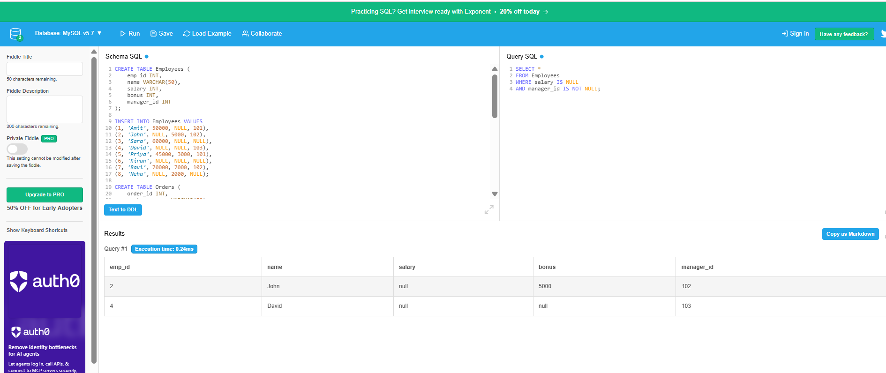

# Day 1 Output Screenshots

This folder contains selected query execution screenshots for Week 2 - Day 1 NULL Functions practice.

## Topics Covered

- IS NULL
- IS NOT NULL
- COALESCE()
- NULLIF()
- NULL Handling in Calculations
- Real-Time NULL Scenarios
- Salary and Bonus Handling
- Product NULL Analysis
- Order Payment Calculations

---

## 📸 Here are some output screenshots from the NULL function queries practiced using DB Fiddle.

---

# Query Outputs

## Query 1 - Employees with NULL Salary

---

## Query 10 - First Available Employee Income

---

## Query 15 - Divide-by-Zero Prevention using NULLIF

---

## Query 17 - Total Employee Earnings Calculation

---

## Query 24 - Employees with NULL Salary but Assigned Manager

---

# Practice Platform

- DB Fiddle
- MySQL Environment

---

# 📂 Output Files

| File Name | Description |
|---|---|
| query1.png | Employees with NULL salary output |
| query10.png | COALESCE income handling output |
| query15.png | NULLIF divide-by-zero prevention output |
| query17.png | Total earnings calculation output |
| query24.png | Employees with NULL salary but manager assigned |

---

Week 2 - Day 1 Outputs Completed 🚀
