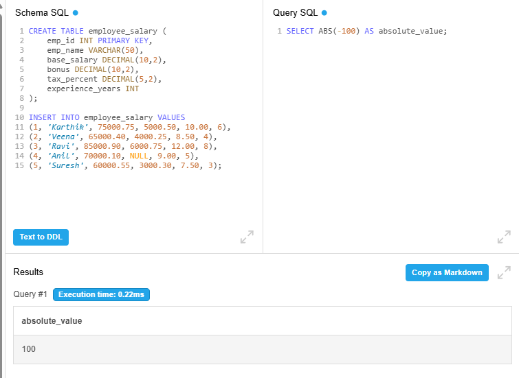
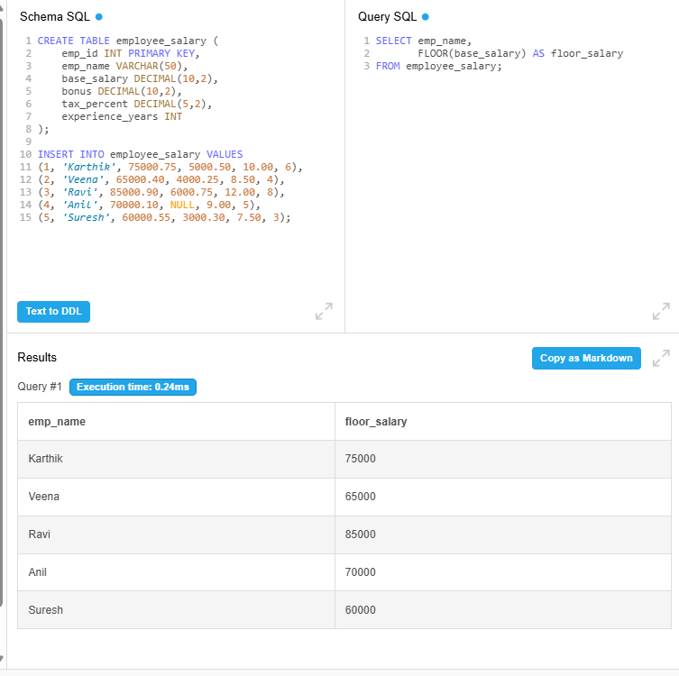
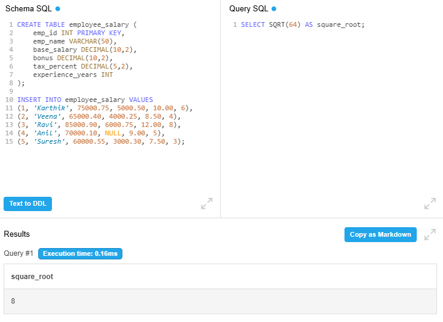
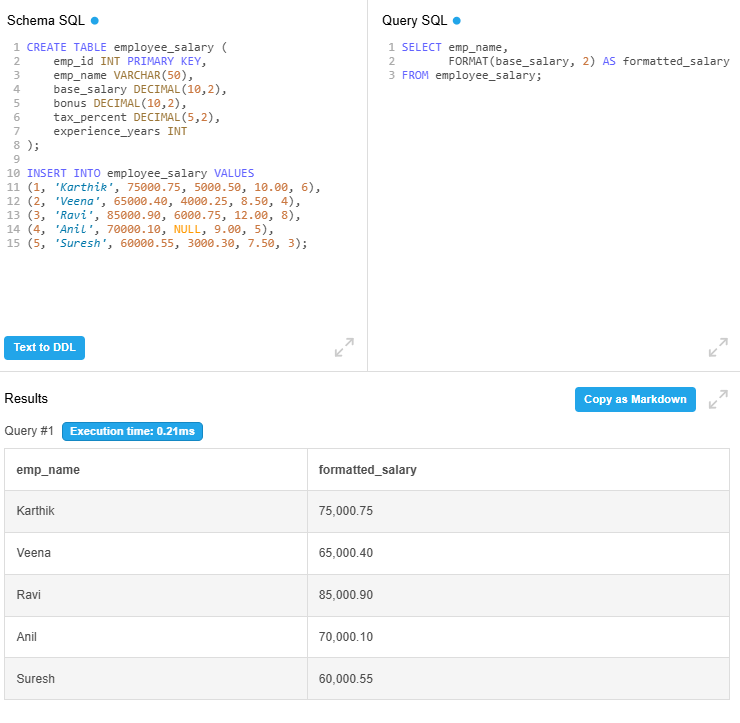

# Day 2 Output Screenshots

This folder contains selected query execution screenshots for Week 2 - Day 2 Number Manipulation Functions practice.

## Topics Covered

- ABS()
- ROUND()
- CEIL()
- FLOOR()
- TRUNCATE()
- MOD()
- POWER()
- SQRT()
- SIGN()
- FORMAT()
- GREATEST()
- LEAST()

---

## 📸 Here are some output screenshots from the Number Function queries practiced using DB Fiddle.

---

# Query Outputs

## Query 1 - Absolute Value Calculation

---

## Query 5 - Decimal Truncation

---

## Query 9 - Number Sign Detection

---

## Query 12 - Greatest Salary or Bonus Value

---

## Query 15 - Least Salary or Bonus Value

---

# Practice Platform

- DB Fiddle
- MySQL Environment

---

# 📂 Output Files

| File Name | Description |
|---|---|
| query1.png | ABS function output |
| query5.png | TRUNCATE function output |
| query9.png | SIGN function output |
| query12.png | GREATEST function output |
| query15.png | LEAST function output |

---

Week 2 - Day 2 Outputs Completed 🚀
