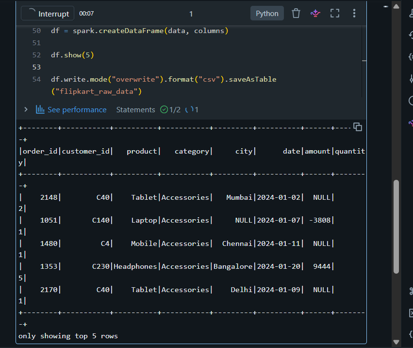

# Day 5 Output Screenshots

This folder contains selected output screenshots for Week 2 - Day 5 PySpark Data Generation practice.

## Topics Covered

- PySpark DataFrame Creation
- Random Data Generation
- NULL Value Handling
- Negative Value Simulation
- Duplicate Records
- CSV/Table Generation

---

## 📸 Here is the output screenshot from the PySpark data generation process practiced using Databricks.

---

# Output Preview

## Generated DataFrame Output

---

# Practice Platform

- Databricks Community Edition
- PySpark

---

# 📂 Output Files

| File Name | Description |
|---|---|
| output.png | Generated PySpark DataFrame output |

---

Week 2 - Day 5 Outputs Completed 🚀
